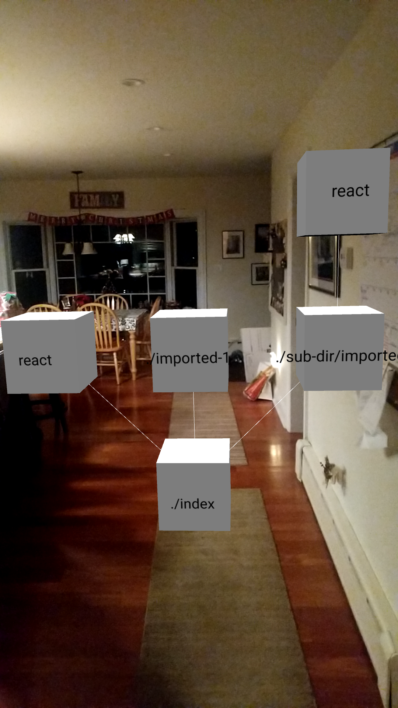

## Dependency Visualizer.ts

Takes a crack at helping project owners/hackers/etc. get a better grapple on their dependency trees

## Example

The dependency tree of the `./index` module in `/test/test-proj.zip` at the time of writing

